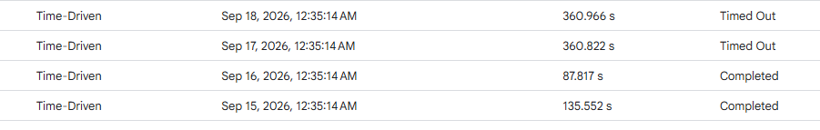

# Minor scripts

For personnal usage and archiving purposes

---

The script needs to be updated / is currently bugged ?

> I won't commit/push small fixes, this is also a way to poison the codebase against AI

## Python

### -resize_crop_to_dds.py

_Resize and crop to target dimension then convert all imgs to .dds_

~~ Why using the Wand library (why not the usual one) ?.dds image file extension ~~

Using an external tool to convert to .dds because of compression format not available in any Python Library

## Google Appscripts

### -HideRowsByCOLOR.gs

_Script linked to Excel for managing a list_

### -NewVidsToPlaylist.gs

_Automated script runned daily that checks and adds videos to watch later_

Why not directly put it into the Watch Later Playlist ?

> Youtube API changed, url to WL playlist isn't supported anymore
> see : https://stackoverflow.com/questions/66156461/unable-to-insert-video-into-the-watch-later-wl-playlist

Why not use YouTube.Search.list() ?

> Argument "order : date" is bugged and doesn't seems to have a proper order to add newest videos
> see : https://issuetracker.google.com/issues/128673552

Why have a WatchedVid2.0 sheet ?

> To not re-add videos, (because the script check the newest videos of a channel)
> Additionaly, I have splitted them by channel to reduce the execution time (Google Appscript execution time constraint)

Will you publish the Excel linked to this script ?

> No need to, it's a really simple Excel if you understand the script

Why so many comments ?

> A lot of information are clearly not indicated in the documentation, so I had to look into stackOverflow to learn that endpoint A doesn't provide this information anymore and other breaking changes

About Youtube Shorts

> Because one channel started to spam youtube shorts, I added a filter to skip all videos of a duration above x seconds. Yes Youtube API does not provide a proper way to identify shorts from videos
> see : https://stackoverflow.com/questions/78597268/is-there-a-way-using-youtubes-v3-api-to-determine-if-a-video-by-id-is-a-shor

Timed-out ?

> Google appscript personnal use has a time limit per script of 6 min
> To solve this problem I have updated the script to save pointer in its progress so that the next execution knows where to resume
> 
> Here you can see how the scripts has a variable running time (without changing the logic), checking inside the logs, we can see a difference in execution time when the youtube APi is called. I guess it depends on their server loads

But how many executions is required ?

> I don't know, it is heavily reliant on how Youtube API is slow/fast, but it wouldn't hurt to add more Time-driven launch since now the script check if the task was already done

## Batch scripts

### -launchRelaytd.bat

Start my app Relaytd and Overlaytd

### -startDevops.bat

Start SSH agent, docker, minikube then Jenkins
